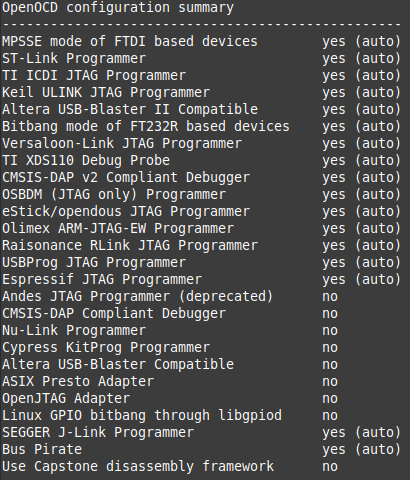
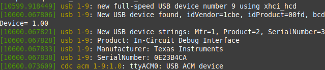
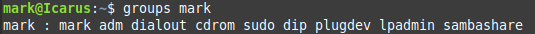
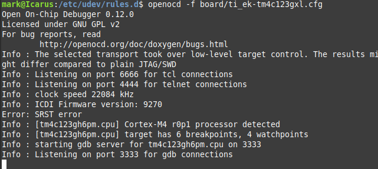
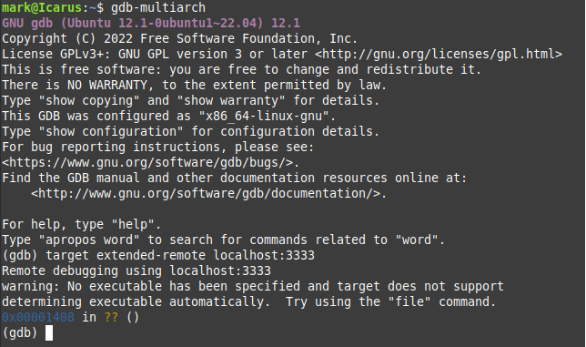
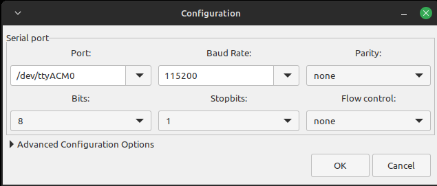

This document describes how to use an Ubuntu 22.04 machine for compiling, flashing, and debugging TM4C123GXL devices using a common IDE used on Linux, Visual Studio Code (VS Code).  VS Code is an alternative to, and a more generalizable solution than, using Texas Instrument's (TI’s) IDE Code Composer Studio (CCS) for software/firmware development on Linux. 

## Software Installation

### Visual Studio Code
 - Purpose: IDE
 - Version: 1.76.0
 - Source: Repos (snap)
     - `$ sudo apt-get install code`
 - Extensions
    - Cortex-Debug (version 1.8.0)
    - C/C++ (version 1.14.4)
    - Python (version 2022.10.1)
    - Others as neccessary or you see fit

### GTKTerm
- Purpose: Connecting/Reconnecting to UART serial interface
- Version: 1.1.1
- Source: Repos
    - `$ sudo apt-get install gtkterm`

### gcc-arm-none-eabi
- Purpose: Cross complier for ARM Cortex R/M processors
- Version: 10.3.1
- Source: Repos
    - `$ sudo apt-get install gcc-arm-none-eabi`

### lm4flash
- Purpose: Flashing binary files to device
- Version: 0.1.3
- Source: Repos
    - `$ sudo apt-get install lm4flash`

### OpenOCD
- Purpose: Allow the debugger (gdb-multiarch) to connect to the on chip debugger
- Version: 0.12.0
- Source: https://sourceforge.net/projects/openocd/
    - The Cortex-Debug extension in vscode expects openocd's config files to be in /usr/local/share/openocd/scripts/; however, version 0.10 and 0.11 both store them in /usr/share/openocd/scripts/ using slightly different names.  Version 0.12.0 does store the scripts in the expected location; therfore, 0.12.0 was installed. 
    - Download and extract the openocd-0.12.0.tar.bz2 from the link above
    - The README indicates to install/verify the installation of the following:
        - make
            - Version used for this guide: 4.3
            - Source: repos
        - libtool
            - Version used for this guide: 2.4.6
            - Source: repos
        - pkg-config
            - Version used for this guide: 0.29.2
            - Source: repos
        - libusb-1.0
            - Version used for this guide: 1.0.25
            - Source: repos
        - `$ sudo apt-get install make libtool pkg-config libusb-1.0`
    - As per the README run the following commands while in the same directory:
        - `./configure`
            - No option flags were needed.
            - You should see something like the following when it is done:
                    

        - `$ make`
        - `$ sudo make install`

## Configuration

### Symlink to gdb-multiarch
- Reasoning: the Cortex-Debug extension calls upon arm-none-eabi-gdb (the cross-compiler's debugger); however, arm-none-eabi-gdb is no longer a binary associated with the gcc-arm-none-eabi suite. It appear that 'gdb-muliarch' is now the gdb used for the cross compiler.  Since the Cortex-Debug error only indicated that it doesn't have the correct *path* to the arm-none-eabi-gdb binary, updating the path settings doesn't solve the issue; however, creating a symlink that points Cortex-Debug to gdb-multiarch when it is calling arm-none-eabi-gdb does.  
- While in the /usr/bin/ directory, run:
    - `$ sudo ln -s gdb-multiarch arm-none-eabi-gdb`
    - `$ sudo chmod 755 arm-none-eabi-gdb`
        - Sets the perms of the symlink the same as the other binaries in /usr/bin/.

### Permissions
- Reasoning: When a usb device (e.g., the TM4C123GXL) is connected, Linux assigns it a name and lists it in the /dev/ directory; however, all users aren't necessarily given permssion to *use* the device.  Permission to used the device needs to be established.
- OpenOCD and CCS both provide files that allow for USB permissions to be automatically assigned; 60-openocd.rules and 71-ti-permissions.rules, respectively. They are both included in this repo in the rules/ directory.  These need to be copied into the /etc/udev/rules.d/ directory (using sudo).
- Since the device name is dynamically assigned upon connecting we can find out what device name the TM4C123GXL was assigned by reviewing recent activity on the system:
    - `$ dmesg`
        - This should result in something like:
                
        - The last line idicates that a USB device was connected
- Now determine the permissions set on the device:
    - `$ ll /dev/ttyACM0`
            
- Verify that the desired user account has access:
    - `$ groups mark`
            
- If permission issues are still occuring, the computer may need to be resarted to load the new rules files. 

## Testing openocd and gdb
- Reasoning: First we need to verify that we can get openocd and gdb-multiarch to communicate with each other before we start using vscode manage the connection. 
- With the TM4C123GXL connected, connect openocd to the board's on chip debugger.  Open a terminal window and type:
    - `$ openocd -f board/ti_ek-tm4c123gxl.cfg`
    - You should see something like this:
            
    - Notice that this creates a server for which debuggers can connect to. 
- Then, start the cross compiler debugger in a second terminal window:
    - `$ gdb-multiarch`
        - This will start the debugger and provide a `(gdb)` prompt to enter commands. Type the following to connect the debugger to the openocd server:
            - `target extended-remote localhost:3333`
            - You should see something like this:
                    
- If everything appears to be working, exit the debugger (`quit`) and terminate openocd (CTL+C).

## Testing VS Code IDE with TI Examples                     

### Obtaining TI Examples
- Reasoning: TI's CCS provides example projects to use for learning how to code their devices.  A subset of these files relevant to the TM4C123GXL (and TM4C129EXL for my own use) have been extracted and saved in this repository. 
- Copy the 'myti/' folder to wherever you would like to have it. 

### The SVD File
- Reasoning: Cortex-Debug needs access to a formal description of the TM4C123GH6PM microcrontroller in order to operate correctly.  
- Copy the TM4C123GH6PM.svd file from this repo into the 'myti/' directory copied earlier. 

### Connect to the TM4C123GXL's UART serial interface
- Reasoning: The example code being used in this guide (qs-rgb) has a UART interface from which some of the settings can be adjusted. We will modify the prompt text then compile and flash the code to the device to confirm that the change was successul. 
- Start the 'Serial port terminal' (a.k.a. gtkterm) application.  Configure it to point to the ttyACM0 interface (or whichever one you established previously).  Then push the reset button on the TM4C.
    - The configuration: 
            
    - After pushing the reset button:
            
            

