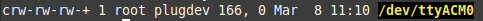
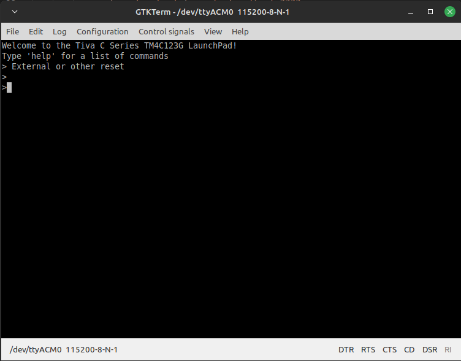

# Intro

This README alonge with the files in this repository provide a guide on how to use an Ubuntu 22.04 machine for compiling, flashing, and debugging TM4C123GXL devices using an IDE commonly used on Linux, Visual Studio Code (VS Code or vscode).  VS Code is an alternative to, and a more generalizable solution than, using Texas Instrument's (TI’s) IDE, Code Composer Studio (CCS), for development on Linux. 

## Software Installation (install now)

### Visual Studio Code
 - Purpose: Integraded Development Environment (IDE)
 - Version: 1.76.0
 - Source: Repos (snap)
     - `$ sudo apt-get install code`
 - Extensions
    - Cortex-Debug (version 1.8.0)
    - C/C++ (version 1.14.4)
    - Python (version 2022.10.1)
    - Others as neccessary or as you see fit

### GTKTerm
- Purpose: Connecting/Reconnecting to UART serial interface
- Version: 1.1.1
- Source: Repos
    - `$ sudo apt-get install gtkterm`

### gcc-arm-none-eabi
- Purpose: Cross complier for ARM Cortex R/M processors
- Version: 10.3.1
- Source: Repos
    - `$ sudo apt-get install gcc-arm-none-eabi`

### lm4flash
- Purpose: Flashing binary files to device
- Version: 0.1.3
- Source: Repos
    - `$ sudo apt-get install lm4flash`

### OpenOCD
- Purpose: Allow the debugger (gdb-multiarch) to connect to the on chip debugger
- Version: 0.12.0
- Source: https://sourceforge.net/projects/openocd/
    - The Cortex-Debug extension in vscode expects openocd's config files to be in /usr/local/share/openocd/scripts/; however, version 0.10 and 0.11 both store them in /usr/share/openocd/scripts/ using slightly different names.  Version 0.12.0 does store the scripts in the expected location; therfore, 0.12.0 was installed. 
    - Download and extract the openocd-0.12.0.tar.bz2 from the link above.
    - The README indicates to install/verify the installation of the following:
        - make
            - Version used for this guide: 4.3
            - Source: repos
        - libtool
            - Version used for this guide: 2.4.6
            - Source: repos
        - pkg-config
            - Version used for this guide: 0.29.2
            - Source: repos
        - libusb-1.0
            - Version used for this guide: 1.0.25
            - Source: repos
        - `$ sudo apt-get install make libtool pkg-config libusb-1.0`
    - As per the README run the following commands while in the README's directory:
        - `./configure`
            - No option flags were needed.
            - You should see something like the following when it is done:
                    

        - `$ make`
        - `$ sudo make install`

## Configuration

### Symlink to gdb-multiarch
- Reasoning: the Cortex-Debug extension calls upon arm-none-eabi-gdb (the cross compiler's debugger); however, arm-none-eabi-gdb is no longer a binary associated with the gcc-arm-none-eabi suite. It appears that 'gdb-muliarch' is now the gdb used for the cross compiler. Since the Cortex-Debug error only indicated that it doesn't have the correct *path* to the arm-none-eabi-gdb binary, updating the path settings doesn't solve the issue; however, creating a symlink that points Cortex-Debug to gdb-multiarch when it is calling arm-none-eabi-gdb does.  
- While in the /usr/bin/ directory, run:
    - `$ sudo ln -s gdb-multiarch arm-none-eabi-gdb`
    - `$ sudo chmod 755 arm-none-eabi-gdb`
        - Sets the perms of the symlink the same as the other binaries in /usr/bin/.

### Permissions
- Reasoning: When a usb device (e.g., the TM4C123GXL) is connected, Linux assigns it a name and lists it in the /dev/ directory; however, users aren't necessarily given permission to *use* the device.  Permission to use the device needs to be configured.
- OpenOCD and CCS both provide files that allow for USB permissions to be automatically assigned when recognized devices are connected to the computer; 60-openocd.rules and 71-ti-permissions.rules, respectively. They are both included in this repository in the rules/ directory.  These need to be copied into the /etc/udev/rules.d/ directory (using sudo).
- Since the device name is dynamically assigned upon connecting we can find out what device name the TM4C123GXL was assigned by reviewing recent activity on the system:
    - `$ dmesg`
        - Example output:
                
        - The last line idicates that a USB device was connected
- Now determine the permissions set on the device:
    - `$ ll /dev/ttyACM0`
        - Example output:
            
- Verify that the desired user account has access:
    - `$ groups mark`
        - Example output:
            
- If permission issues are still occuring, the computer may need to be resarted to load the new rules files. 

## Testing openocd and gdb
- Reasoning: First we need to verify that we can get openocd and gdb-multiarch to communicate with each other before we start using vscode to manage the connection. 
- With the TM4C123GXL connected, open a terminal window and type:
    - `$ openocd -f board/ti_ek-tm4c123gxl.cfg`
    - Example output:
            
    - Notice that this creates a server for which debuggers can connect to. 
- Then, start the cross compiler debugger in a second terminal window:
    - `$ gdb-multiarch`
        - This will start the debugger and provide a `(gdb)` prompt to enter commands. Type the following to connect the debugger to the openocd server:
            - `target extended-remote localhost:3333`
            - Example output:
                    
- If everything appears to be working, exit the debugger (type `quit`) and terminate openocd (CTL+C).

## Testing VS Code IDE with TI Examples                     

### Obtaining TI Examples
- Reasoning: TI's CCS provides example projects to use for learning how to code their devices.  A subset of these files relevant to the TM4C123GXL (and TM4C129EXL for my own use) have been extracted and saved in this repository. 
- Copy the 'my_tiva_c/' folder to wherever you would like to work with it. 

### The SVD File
- Reasoning: Cortex-Debug needs access to a formal description of the TM4C123GH6PM microcrontroller in order to operate correctly.
- Original Source: https://github.com/posborne/cmsis-svd/blob/master/data/TexasInstruments/TM4C123GH6PM.svd  
- Copy the TM4C123GH6PM.svd file from this repository into the 'my_tiva_c/' directory copied earlier. 

### Connect to the TM4C123GXL's UART serial interface
- Reasoning: The example code (which is also the code the TM4c123GXL is shipped with) being used in this guide (qs-rgb) has a UART interface from which some of the functionality can be adjusted. We will modify the prompt text then compile and flash the code to the device to confirm that the change was successul. 
- Start the **Serial port terminal** (a.k.a. gtkterm) application.  Configure it to point to the ttyACM0 interface (or whichever one you identified previously).  Then push the reset button on the TM4C.
    - The configuration: 
            
    - After pushing the reset button:
            
            
### Edit the UART prompt in qs-rgb.c
- Reasoning: Edit the UART prompt so that we can verify that the updated binary was flashed to the device. 
- Navigate to the my_tiva_c/examples/boards/ek-tm4c123gxl/qs-rgb/ directory copied earlier and open qs-rgb.c with the editor of your choice.
- Go to the UART Prompt (on or around line 542) and change some text. 
- Save and exit the file. 

### Edit the Makefile in qs-rgb
- Reasoning: To allow us to easily flash the TM4C123GXL from the command line using "make flash", we need to edit the Makefile to perform the flash.
- Go to the qs-rgb/' directory and open the Makefile in your desired text editor. 
- Add the following at the beginning of the Makefile. Be sure to change the DEV if the device was connected to a differnt port than ttyACM0:

        #DEV : The serial device will likely be /dev/ttyACM0
        DEV=/dev/ttyACM0
        
        #FLASHER: The flash utility used
        FLASHER = lm4flash
- Add the following to the end of the Makefile

        #Flashes bin to TM4C123GXL
        flash:
        $(FLASHER) -S $(DEV) ${COMPILER}/qs-rgb.bin
- Save and exit the file. 

### Make and flash the binary files
- Reasoning: The TI example binary files (and other important files) have not been created yet. They need to be created then flashed to the device. 
- While in the 'qs-rgb/' directory, type `make` on the command line to compile the code.
- Then type `make flash` to flash the device. 
- A review of UART interface (via GTKTerm) should show the changes you made to the UART prompt. 
- All terminals except the GTKTerm terminal can be closed now.

### Setting up the debugger launch file in VS Code
- Open VS Code and open the my_tiva_c/examples/boards/ek-tm4c123gxl/qs-rgb/ folder.  
- Click on the 'create a lauch.json file' in the debugger section of the interface:
      
- Replace the text in the launch.json file with the following:
        
    ``` 
        {
            // Use IntelliSense to learn about possible attributes.
            // Hover to view descriptions of existing attributes.
            // For more information, visit: https://go.microsoft.com/fwlink/?linkid=830387
            "version": "0.2.0",
            "configurations": [
                {
                    "name": "Cortex Debug",
                    "cwd": "${workspaceFolder}",
                    "executable": "./gcc/qs-rgb.axf", // This changes for each project
                    "request": "launch",
                    "type": "cortex-debug",
                    "runToEntryPoint": "main",
                    "servertype": "openocd",
                    "device": "TM4C123GH6PM",
                    "configFiles": [
                        // "interface/ti-icdi.cfg", // This isn't needed.  I get an "already configured" warning
                        "board/ti_ek-tm4c123gxl.cfg"
                    ],
                    "svdFile": "../../../../TM4C123GH6PM.svd"
                }
            ]
        } 

## Putting it all together
- Edit the UART command prompt text in the qs-rgb.c file again and save the changes.
- Open a terminal *within* vscode (CTL+Shift+`) and type the following
    - `make`
    - `make flash` 
- Review changes in the GTKTerm.
- Run the Debugger (F5).  You should see the debugger controls (see pic) near the top of the window.

    

# Summary
This guide provided you with an example of how to use VS Code as an IDE on Ubuntu 22.04. The intent was to explain this clearly enough to allow you to make your own projects for the TM4C123GXL using this setup, not just TI examples. 

Happy coding!